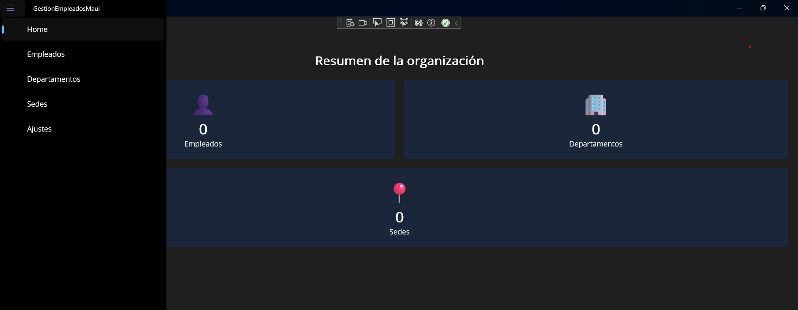

# 📱 Gestión de Empleados - Frontend (.NET MAUI)

Aplicación cliente para visualizar **sedes, departamentos y empleados** consumiendo la API de backend en FastAPI.  
La app está desarrollada con **.NET MAUI** usando el patrón **MVVM**.

---

## 🧩 Funcionalidades principales

- Visualización de empleados, sedes y departamentos
- Pantalla principal con métricas globales
- Vista detallada de cada elemento (ItemDetailView)
- Cambio de tema claro / oscuro
- Navegación entre páginas
- Aplicación de **solo lectura** (no permite crear, editar ni borrar elementos)

---

## 🛠 Tecnologías utilizadas

- .NET MAUI
- Patrón MVVM
- CommunityToolkit.Mvvm
- Dependency Injection
- XAML

---

## 📂 Estructura del proyecto
GestionEmpleadosMaui/
├── Models/ → Clases de datos
├── PageModels/ → Lógica de presentación
├── Pages/ → Interfaces de usuario
├── Services/ → Comunicación con la API
├── Platforms/ → Configuración específica de cada plataforma
├── Resources/ → Imágenes, estilos y fuentes
├── App.xaml → Definición global de la app
└── GestionEmpleadosMaui.csproj


---

## 🚀 Instalación y ejecución

1. Instalar **Visual Studio** con soporte para MAUI
2. Abrir el proyecto `.sln` en Visual Studio
3. Ejecutar la app en **emulador** o **dispositivo físico**
4. Asegurarse de que el **backend esté activo** en:
```bash
http://localhost:8000




👨‍💻 Autor

Álvaro Lorenzo Carrillo
Estudiante de 2º DAM
IES Luis Vives
